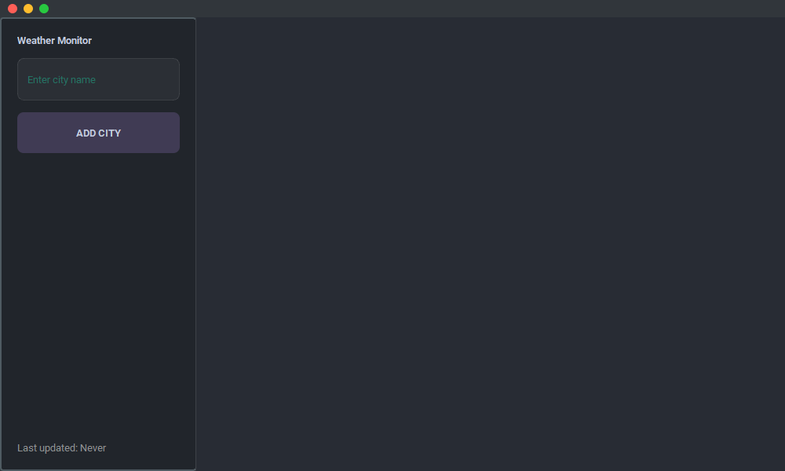

# Weather Monitor 🌤️

A beautiful and modern weather monitoring application built with Python and PyQt5. Get real-time weather updates and forecasts for your favorite cities with a sleek macOS-inspired interface.



## ✨ Features

- 🌍 **Real-time Weather Data**: Get current weather conditions including temperature, humidity, wind speed, and more
- 📅 **7-Day Forecast**: View detailed weather forecasts for the next week
- 🏙️ **Multiple Cities**: Monitor weather for multiple cities simultaneously
- 🔄 **Auto Updates**: Weather data automatically refreshes every 10 minutes
- 🎨 **Modern UI**: Beautiful dark theme with macOS-style window controls
- 💾 **Persistent Storage**: Your city list is automatically saved and restored

## 🚀 Getting Started

### Prerequisites

- Python 3.8 or higher
- pip (Python package installer)

### Installation

1. Clone the repository:
```bash
git clone https://github.com/FodiYes/WeatherMonitor.git
cd WeatherMonitor
```

2. Install the required dependencies:
```bash
pip install -r requirements.txt
```

3. Run the application:
```bash
python main.py
```

## 🛠️ Built With

- [Python](https://www.python.org/) - Programming language
- [PyQt5](https://www.riverbankcomputing.com/software/pyqt/) - GUI framework
- [Open-Meteo API](https://open-meteo.com/) - Weather data provider
- [qt-material](https://github.com/UN-GCPDS/qt-material) - Material design styling

## 📖 How to Use

1. **Adding a City**
   - Enter the city name in the input field
   - Press Enter or click "Add City"
   - The weather card for the city will appear in the main area

2. **Viewing Forecast**
   - Click the "▼" button on any weather card
   - A 7-day forecast will expand showing detailed weather information

3. **Removing a City**
   - Click the "×" button on the weather card
   - The city will be removed from your monitoring list

4. **Window Controls**
   - Red button: Close the application
   - Yellow button: Minimize window
   - Green button: Toggle fullscreen

## 🎨 Features

### Current Weather Information
- Temperature in Celsius
- Humidity percentage
- Wind speed
- Weather conditions description

### Forecast Details
- Daily minimum and maximum temperatures
- Precipitation probability
- Wind speed
- Weather conditions

### UI Features
- Dark theme for comfortable viewing
- Responsive layout
- Smooth animations
- macOS-style window controls

## 📝 License

This project is licensed under the MIT License - see the [LICENSE](LICENSE) file for details.

## 🤝 Contributing

Contributions, issues, and feature requests are welcome! Feel free to check the [issues page](https://github.com/yourusername/weather-monitor/issues).

## 👨‍💻 Author

Made with ❤️ by DAN

## 🙏 Acknowledgments

- [Open-Meteo](https://open-meteo.com/) for providing the weather data API
- [PyQt5](https://www.riverbankcomputing.com/software/pyqt/) for the amazing GUI framework
- [qt-material](https://github.com/UN-GCPDS/qt-material) for the material design theme
